# 📱 Shopping & Notes List App


---

## 🧩 About the app

🛒📝 Shopping & Notes List App is a modern Android application that combines shopping lists and notes
in a clean and minimalistic UI.

The app supports dynamic themes, custom color palettes, Material You, and flexible UI settings via
Settings screen.

Built with Kotlin using MVVM architecture and Room database.

---

## 💡 Motivation

This project was created to practice:

- scalable Android architecture
- complex RecyclerView interactions
- UI testing with Espresso
- dynamic theme switching
- modern Material Design principles

---

## ✨ Features

- 📝 Create, edit, and manage notes
- 🛒 Create and manage shopping lists
- 🎨 Custom note colors
- 🗂 Multiple layouts (Grid / Linear)
- 🌗 Light / Dark / System theme
- 🎨 Custom color palettes + Material You (Dynamic Colors)
- ⚙️ Settings screen (PreferenceFragmentCompat)
- 🔄 Instant theme switching (no app restart)
- 💳 In-App Billing (ads removal)
- 💾Local database (Room + Coroutines)

---

## 🖼 Screenshots

---

### 🎥 App Demo

#### Notes Flow

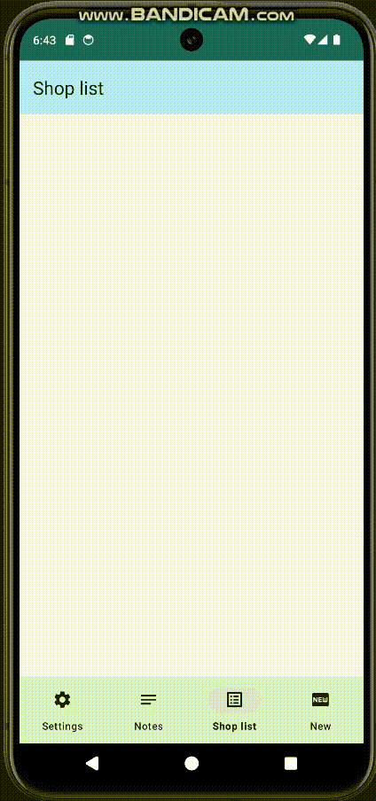

#### Shopping Lists Flow

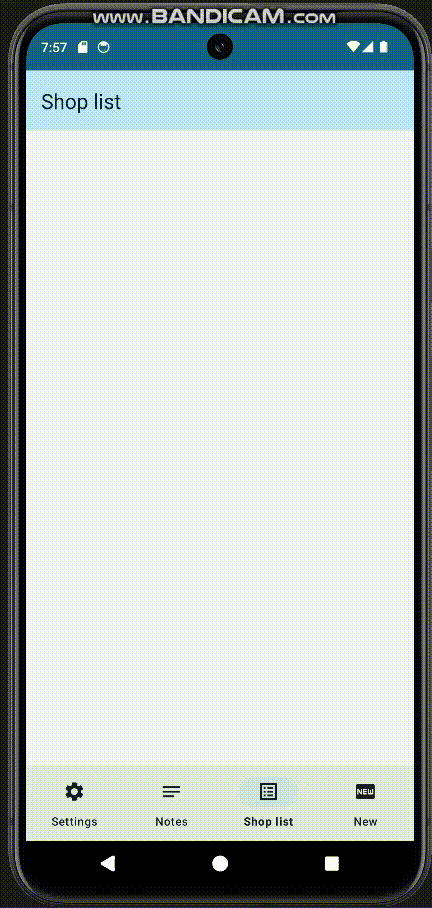

#### Settings Flow

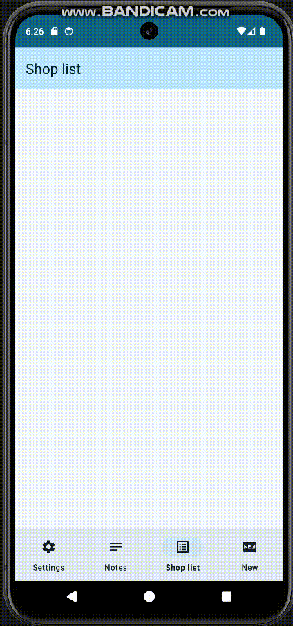

### 📝 Notes

<p >
  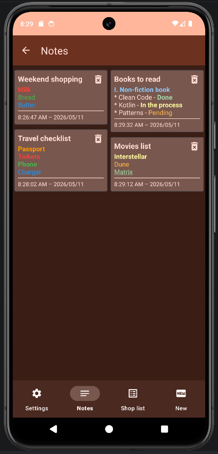
  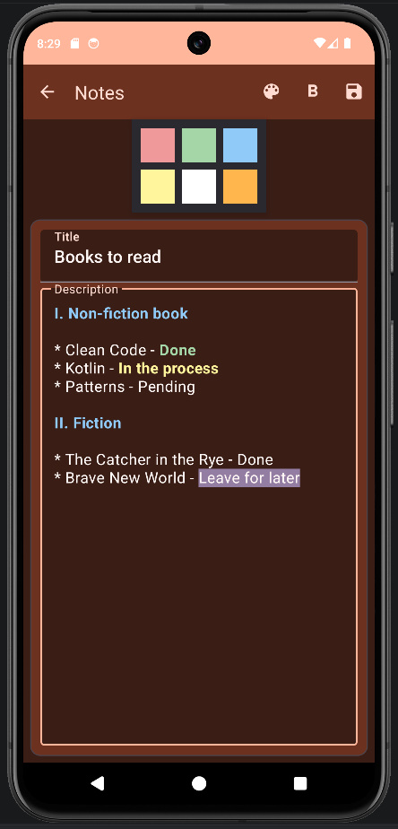
  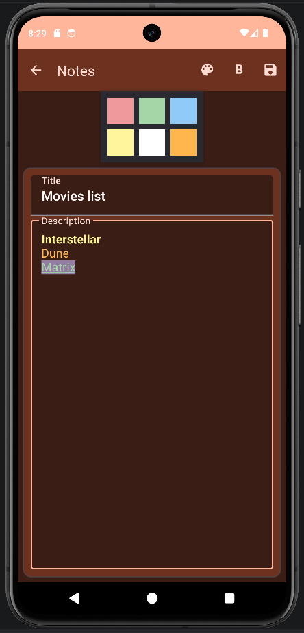
</p>

<p >
  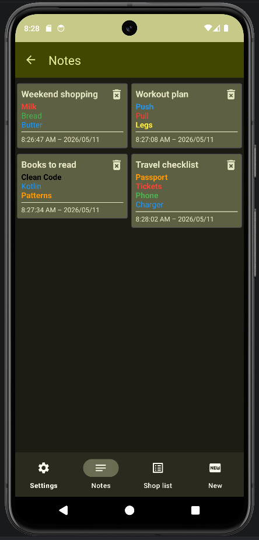
  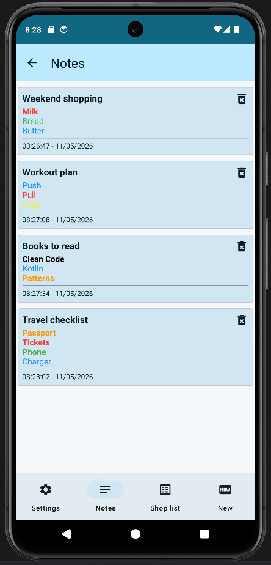
  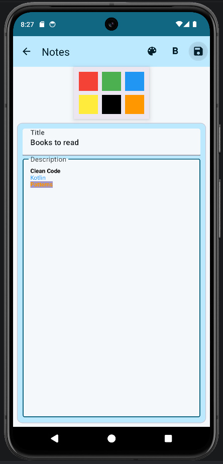
</p>

---

### 🛒 Shopping Lists

<p >
  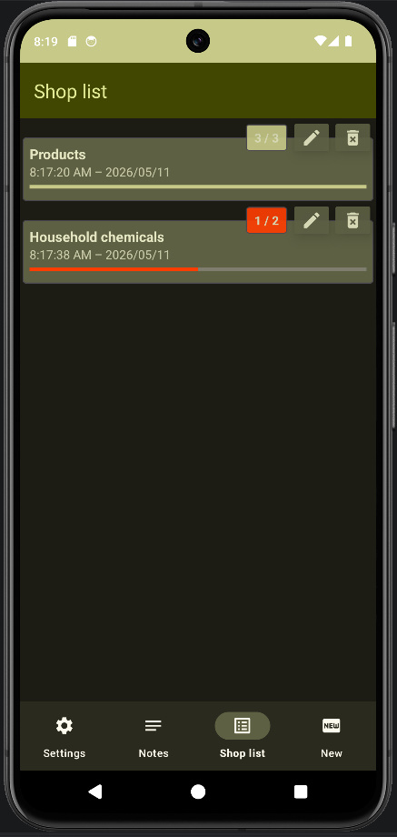
  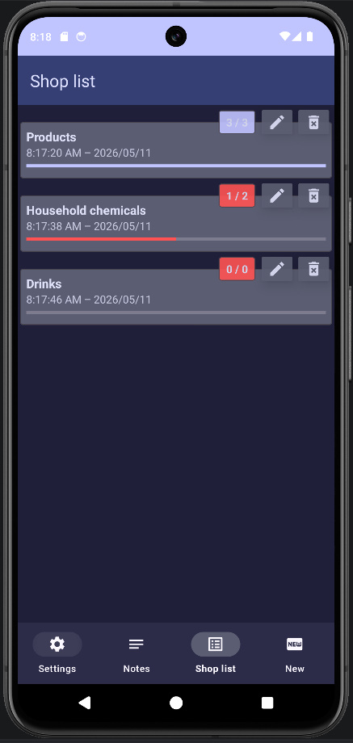
  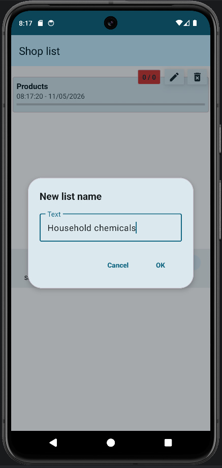
</p>

---

### ⚙️ Settings

<p >
  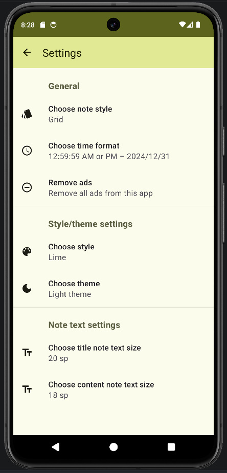
  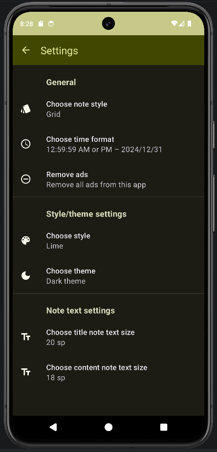
  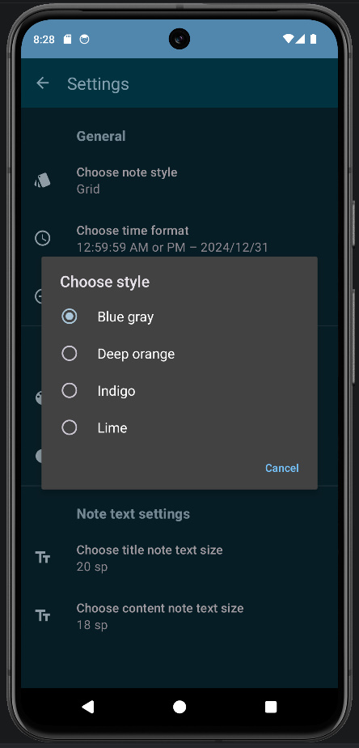
</p>

---

## 🏗 Architecture

The app follows a simplified layered architecture:

### Layers

- **UI layer** — Activities & Fragments
- **ViewModel** — UI logic only (no direct DB access)
- **Repository** — single source of truth, handles business logic
- **Room (DAO)** — data layer

### Why Repository?

- Separates concerns
- Makes code scalable
- Easier to test
- Ready for adding network (API)

### Key principles:

- Separation of concerns
- Single source of truth (Repository)
- Minimal logic in UI layer

---

## ⚙️ Tech Stack

- **Kotlin**
- **Android Jetpack**
    - ViewModel
    - LiveData / Flow
    - Room
    - Navigation Component
    - PreferenceFragmentCompat
- **Material Design 3 (Material You)**
- **RecyclerView + DiffUtil**
- **Coroutines**
- **Google Play Billing**

---

## 🎨 Theme System

- Multiple predefined color palettes
- Dynamic Material You support
- Centralized theme control via:
    - `BaseActivity`
    - `ThemeManager`

---

## 📁 Project Structure

```text
com.example.shoppingAndNotesListApp
├── core
│   ├── billing
│   ├── preferences
│   └── utils
│
├── data
│   ├── db
│   │   ├── dao
│   │   └── database
│   ├── model
│   └── repository
│
├── ui
│   ├── activities
│   ├── fragments
│   ├── adapters
│   ├── dialogs
│   └── viewmodel
│
└── settings
```


---

## 🧭 Navigation

- **MainActivity**
    - Shopping Lists → `ShopListFragment`
    - Notes → `NoteFragment`
    - Settings → `SettingsActivity`

Settings are implemented as a separate Activity for simpler theme handling.

---

## 🧪 Testing

The project contains multiple Espresso end-to-end UI tests covering:

- Full shopping list flow
- Full notes flow
- Dynamic theme switching
- RecyclerView interactions
- Toolbar navigation
- Settings persistence
- Text formatting workflow
- Activity recreation after theme changes

Testing stack:

- Espresso
- ActivityScenarioRule
- Intents API
- RecyclerViewActions

---

## 🚀 Getting Started

### Requirements

- Android Studio (Giraffe or newer)
- Gradle 8+
- minSdk 26
- targetSdk 34+

### Installation

git clone https://github.com/nolikstolikxxx/shopping-notes-app

open in Android Studio
Run ▶

## 🔜 Roadmap

* ☁️ Cloud sync (Firebase / Google Drive)
* 🔍 Notes search
* 📦 List groups
* 🖼 Improved Note Editor
* 📱 Home screen widgets

## 📄 MIT License